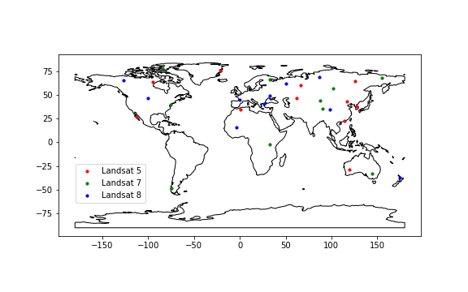

# **landsat578-water**
A tutorial about deep learning of the surface water features on the Landsat-5, -7 and -8 images.
### **Objectives**
1. !!! 100 labeled landsat images.
2. !!! Achieve high-accurate surface water mapping (oa/miou > 90%) by using deep ConvNet models.
### **Image labeling in process**
Distribution of the labeled landsat images are below:

